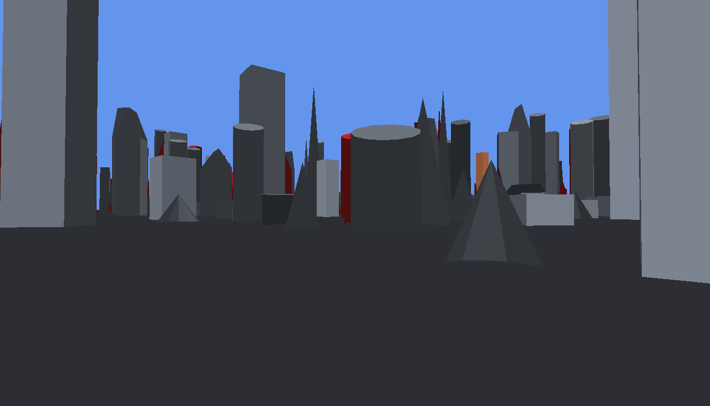
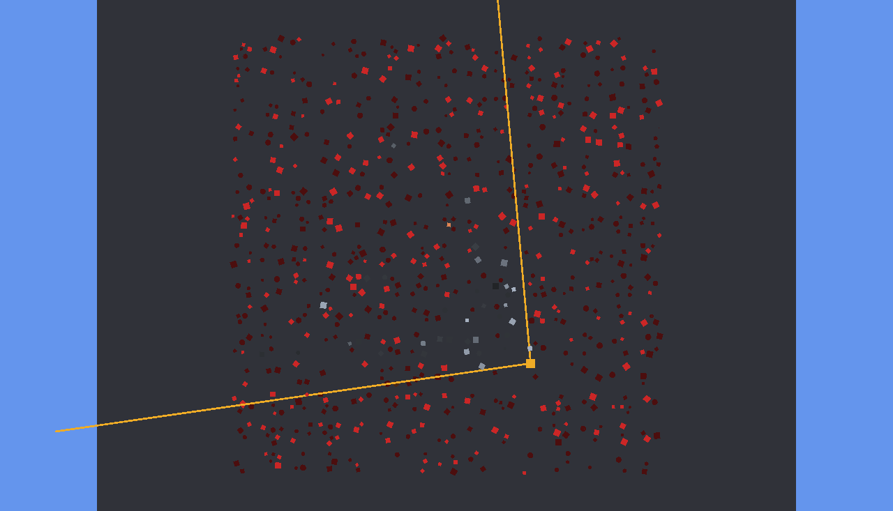

# CityCulling

A city of primitives drawn with the **Evergine low-level graphics API**, with **Embree deciding
which objects reach the GPU**. The GPU draws; the CPU works out what is worth drawing.


A thousand buildings — boxes, cylinders, cones and gabled wedges — laid out in blocks with
streets between them, on a ground plane, and a camera orbiting at **street level**. The eye
height is the whole point: at 2.2 units against buildings 4 to 46 tall, the first row of facades
hides nearly everything behind it. Lift the camera above the rooftops and there is almost
nothing left to cull.

## What it does per frame

1. **Frustum**, six planes against each object's world AABB.
2. **Occlusion with Embree**: nine sample points per surviving object, one closest-hit ray each,
   and the object is visible if any ray reaches it before anything else. Early exit on the first
   sample that gets through.
3. **One draw call per visible object.**

The occlusion strategy is the winner from the
[OcclusionCulling](../OcclusionCulling/README.md) benchmark in this repository: per-object rays,
single-ray queries. There it came out three times cheaper than a visibility buffer and discarded
more; packets lost because filling eight lanes gives up the early exit and rays aimed at eight
different buildings diverge immediately.

## Results at the capture angle

```
objects 1000, frustum candidates 538, visible 56, culled 94.4%
screen area held by discarded objects: 1.56%
```

**56 draw calls instead of 1000.** The frustum alone gets it to 538 — at street level, half the
city is behind you. Embree removes 482 more, which is the part frustum culling cannot do.



The same frame with everything drawn and the discarded objects in red. Red on screen is a
mistake, and what is left is slivers between buildings: 1.56% of the covered screen area.



From above, with the camera in amber and its two frustum edges. The kept objects are the pale
wedge just in front of the camera; everything beyond the first row of facades is red. That
narrow wedge is what 94% culling looks like.

## What it costs, across a full orbit

`--bench` turns VSync off and sweeps a full circle in 360 steps, so the numbers cover every
direction the camera can face rather than whichever ones an animation happened to land on.

```
                        min     median       mean        max
culling               0.306      0.422      0.437      0.816  ms
whole frame           0.533      0.696      0.705      2.050  ms
draw calls                2         36         35         75
```

**The culling costs 0.42 ms, which is 2.5% of a 16.6 ms frame at 60 Hz**, and it removes 964
draw calls.

## And it does not pay for itself here

`--bench --no-cull` skips the occlusion pass and draws everything:

```
                        min     median       mean        max
culling               0.117      0.123      0.129      0.247  ms   (frustum only)
whole frame           0.418      0.589      0.635      1.369  ms
draw calls            1,001      1,001       1001      1,001
```

The frame is **faster without the occlusion pass**: 0.59 ms against 0.70 ms. Taking the culling
out of both, 1,001 draw calls of this geometry cost 0.47 ms and 36 cost 0.27 ms — so the pass
spends 0.30 ms of CPU to save 0.19 ms of drawing, and loses 0.11 ms on the deal.

That is not a defect in the culling, it is the scene. These are boxes and cones of a couple of
dozen triangles with a two-line shader; there is almost nothing to save by not drawing one. The
pass breaks even when an average object costs about 0.3 µs more than it does here, and wins
comfortably beyond that — which is to say, with real meshes, real materials and real overdraw.
The 0.42 ms is what the technique costs; whether it is worth paying depends entirely on what a
draw call costs you.

Worth knowing before wiring this into an engine, and worth measuring there rather than trusting
this number.

## Things worth knowing before copying this

**Evergine's depth is reversed.** `DepthStencilStates.ReadWrite` compares `GreaterEqual` and
`ClearValue.Default` clears depth to 0, so the projection has to be built with
`Matrix4x4.CreatePerspectiveFieldOfView(..., reverseDepthBuffer: true)` from
`Evergine.Mathematics` — `System.Numerics` has no such parameter. Get it wrong and the scene is
empty or inside out, which looks exactly like a culling bug and is not one. The sample uses
Evergine.Mathematics for the matrices that go to the GPU and System.Numerics for the culling,
which only needs the six frustum planes and does not care about the depth convention.

**Rotations must match on both sides, and the sense is not the textbook one.** Evergine's
`CreateRotationY` with the row-vector convention the shader uses gives `x' = x·cos + z·sin` and
`z' = -x·sin + z·cos`. The Embree geometry is baked into world space by hand, so it has to use
that exact form. Baking the opposite sense rotates the geometry Embree sees away from the
geometry the GPU draws, and the culling then discards objects that are plainly on screen — with
no other symptom.

**You cannot update a buffer inside a render pass.** `ValidationLayer` rejects it, and while DX11
lets it through with a trace, Vulkan and DX12 do not. That is why per-object data rides in a
per-instance vertex buffer selected with `startInstanceLocation` rather than a constant buffer
rewritten between draws.

**Do not let the buildings overlap.** The first version placed them at random and let them
interpenetrate; that put the wrongly-discarded screen area at 3.83%, because a discarded object
growing through a kept one paints over it. Rejecting overlapping footprints took it to 0.31% on
the same layout. Interpenetration also makes the debug view lie: it shows red where the culling
was right.

**Sample points go inside the object, not on its bounding box.** A ray aimed at an AABB corner
grazes the surface at best, and for a cylinder or a cone the corner is outside the shape
entirely, so the ray sails past and reports whatever stands behind. The points here are pulled
12% in from the corners.

## `embree.png`, and why it exists


The same view, traced against the Embree scene and coloured by verdict. It is a diagnostic, not
a feature: the culling can only be as correct as the agreement between the triangles the GPU
draws and the triangles Embree holds, and **nothing else in the sample would notice if the two
drifted apart**. The render would look right and objects would simply vanish for no reason. Put
this next to `city.png` and a disagreement is obvious in a second — it is what found the rotation
bug above.

It also produces the accuracy number, measured on Embree's own geometry rather than on anything
the renderer believes.

## Running it

```bash
dotnet run --project CityCulling -c Release
```

The window orbits the city; the status bar shows draw calls, cull percentage, culling cost and
frame time. The toolbar can pause the camera, tint the discarded objects red, and write the
captures. `--capture --exit` writes them at a fixed angle and quits.

Windows only: this one is WinForms plus DX11. The binding itself runs on every RID it ships for,
and `OcclusionCulling` is the cross-platform sample.
