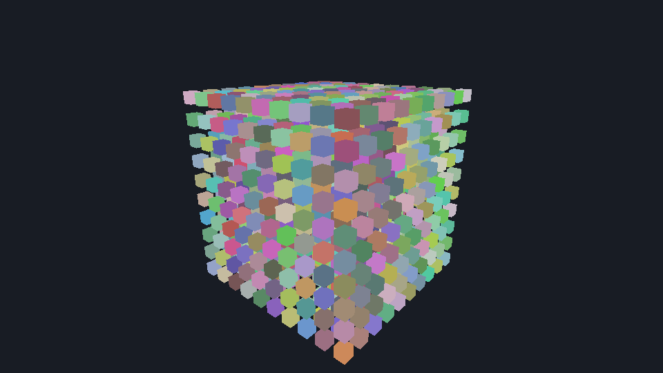
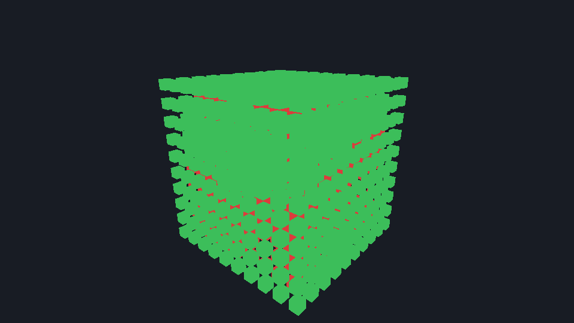
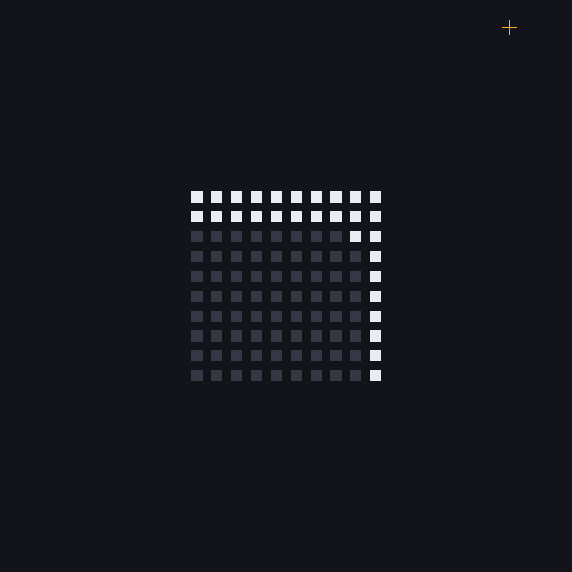

# OcclusionCulling

What a CPU occlusion culling pass costs over a thousand objects, with Embree answering the
visibility queries. No shading, no lighting, no shadows: this measures visibility and nothing
else.



A 10×10×10 grid of boxes — 1,000 objects, 12,000 triangles, one Embree geometry each so every
box has its own `geomID`. The camera sits outside looking in, which is the situation occlusion
culling exists for: the outer shell hides most of the interior.

## The two passes

Both run after a frustum pass, which is the order a real engine uses. They answer different
questions and their cost scales with different things.

**Per-object rays.** Nine sample points per box (eight AABB corners and the centre), one ray
each, stopping at the first sample that reaches the box. Cost scales with the object count. This
is what an engine runs to decide which draw calls to submit.

**Visibility buffer.** A 320×180 grid of primary rays; whatever geometry they land on is
visible. Cost scales with resolution and does not care how many objects there are.

Each comes in a single-ray and an 8-wide packet form.

## Results

24 logical cores, Embree 4.4.1 built with `EMBREE_MAX_ISA=AVX2`:

```
Method                                        median      mean       rays   visible  culled   miss  screen
frustum only                                 0.004ms   0.004ms          0     1,000    0.0%      0   0.00%
per-object, single ray                       0.158ms   0.155ms      7,165       342   65.8%    163   3.07%
per-object, 8-wide packets                   0.218ms   0.217ms      9,000       342   65.8%    163   3.07%
visibility buffer 320x180, single ray        0.623ms   0.636ms     57,600       457   54.3%     48   0.16%
visibility buffer 320x180, 8-wide packets    0.626ms   0.636ms     57,600       457   54.3%     48   0.16%
```

`miss` counts visible boxes the pass discarded — the ones that would pop. `screen` is how much
of the covered screen area those boxes actually held, which is the number that matters: in a
grid this dense most of what is technically visible is visible through a gap a pixel or two
wide.

**The per-object pass costs 0.16 ms and removes two thirds of the draw calls.** Against a 16.6 ms
frame that is about 1%, so it pays for itself as soon as the objects it removes cost more than
that to draw.



Green is a box the per-object pass kept, red one it discarded. The red is all slivers showing
through gaps — 163 boxes, but 3% of the screen.



The middle layer seen from above, camera at the cross. The shell facing the camera survives, the
interior does not.

## Things worth knowing before copying this

**Ask the device how wide a packet it supports.** `rtcIntersect16`/`rtcOccluded16` may only be
called when `RTC_DEVICE_PROPERTY_NATIVE_RAY16_SUPPORTED` says so; calling them anyway is
undefined behaviour, and in practice it corrupts the heap and takes the process down somewhere
unrelated with no hint of the real cause. The binaries this package ships are built with
`EMBREE_MAX_ISA=AVX2`, which tops out at 8 — 16 needs AVX-512. The sample prints the width it
found.

**Packets are not automatically faster.** Here they are slower for the per-object pass, because
filling eight lanes means giving up the early exit: the moment one sample proves a box visible
the rest are pointless, but the lanes are already committed. 9,000 rays instead of 7,165, and
the SIMD saving does not cover the difference. For the visibility buffer, where all rays are
needed anyway, they come out level. Both results are worth having; neither was obvious in
advance.

**The obvious formulation of the per-object test is wrong.** Aiming an occlusion ray at a sample
point on a box and stopping just short of it has the box occlude itself: the point is on its
surface, so its own front face is in the way for all but a few silhouette corners. This asks
what the ray hits *first* instead, which costs more per ray and answers the question actually
being asked.

**Ray structures must be aligned.** `RTCRay8` wants 32 bytes, `RTCRay16` wants 64, and a C#
local guarantees neither. Every buffer here comes from `NativeMemory.AlignedAlloc`.

## Running it

```bash
dotnet run --project OcclusionCulling -c Release
```

`--images` also writes `scene.png`, `verdict.png` and `slice.png` to the working directory. The
PNG writer is about sixty lines in `Png.cs`, which keeps the sample free of dependencies and
able to run on every RID the binding ships; `System.Drawing` would have pinned it to Windows.
