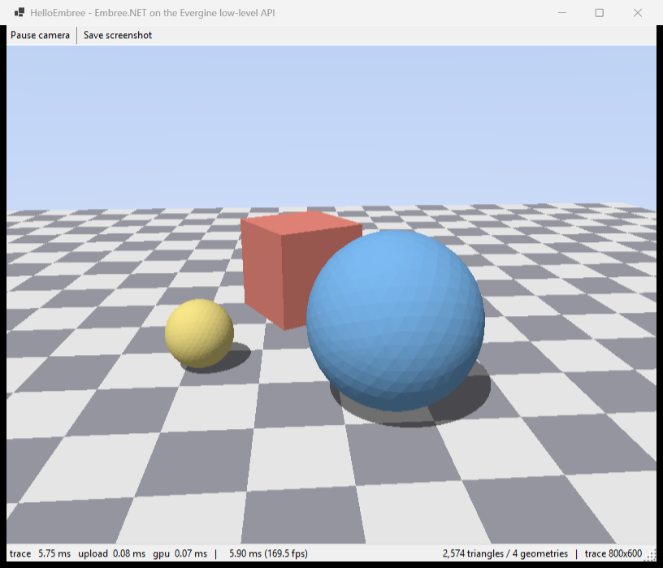

# Embree.NET

This repository contains low-level bindings for [Embree](https://github.com/RenderKit/embree) used in [Evergine](https://evergine.com/).
This binding is generated from the Embree release:
[https://github.com/RenderKit/embree/releases/tag/v4.4.1](https://github.com/RenderKit/embree/releases/tag/v4.4.1)

[](https://github.com/EvergineTeam/Embree.NET/actions/workflows/CI.yml)
[](https://github.com/EvergineTeam/Embree.NET/actions/workflows/CD.yml)
[](https://www.nuget.org/packages/Evergine.Bindings.Embree)

## Purpose

Embree is Intel's high-performance ray tracing kernel library. It builds acceleration
structures (BVHs) over triangles, quads, curves, subdivision surfaces, points, grids and
user-defined primitives, and traverses them with hand-tuned SIMD kernels for SSE, AVX2,
AVX-512 and NEON. It is the traversal backend behind most CPU renderers.

These bindings expose the full C API (`rtcore.h`) to .NET so Evergine can use Embree for
CPU ray tracing, lightmap baking, ambient occlusion and general geometric queries.

## Features

- **Devices, scenes and geometry** — the complete `rtcNewDevice` / `rtcNewScene` /
  `rtcNewGeometry` lifecycle, with type-safe handle structs (`Device`, `Scene`, `Geometry`,
  `Buffer`, `BVH`, `Traversable`).
- **Ray queries** — `Intersect1/4/8/16` and `Occluded1/4/8/16`, plus the `Traversable`
  and `Forward` variants used from instancing callbacks.
- **All geometry types** — triangles, quads, grids, subdivision surfaces, every curve
  basis, points, instances, instance arrays and user geometry.
- **Callbacks** — filter, intersect, occluded, bounds, displacement, error, memory monitor
  and progress monitor, exposed both as `delegate* unmanaged[Cdecl]` parameters and as
  `[UnmanagedFunctionPointer]` delegates.
- **Point queries** — closest-point search with the full context/transform stack.
- **BVH builder API** — `rtcBuildBVH` with user-supplied node/leaf allocation callbacks.
- **Hand-written helpers** for the header's `RTC_FORCEINLINE` functions, which have no
  exported symbol: `InitIntersectArguments`, `InitRayQueryContext`, `DefaultBuildArguments`,
  the quaternion decomposition setters, `Interpolate0/1/2` and the SoA `RayN_*` / `HitN_*`
  packet accessors.

## Supported Platforms

- [x] Windows x64
- [x] Linux x64, ARM64
- [x] MacOS ARM64
- [ ] Windows ARM64 — Embree 4.4.1 does not build for this target with either toolset on the
  runner: MSVC does not define the `__ARM_NEON`/`__aarch64__` macros Embree gates its ARM path
  on, and clang-cl gets past that only to be handed `-msse2` for an ARM64 target by Embree's
  own CMake. Both are upstream gaps.

## Usage notes

**Ray structures must be aligned.** `RTCRay` and `RTCRayHit` require 16-byte alignment,
`RTCRay8` requires 32 and `RTCRay16` requires 64 — Embree's kernels use aligned SIMD loads.
A C# local or array element carries no such guarantee, so taking the address of a stack local
crashes on some code paths and appears to work on others. Allocate ray structures with
`NativeMemory.AlignedAlloc`:

```csharp
RayHit* rayhit = (RayHit*)NativeMemory.AlignedAlloc((nuint)sizeof(RayHit), 64);
```

The C alignment of every generated struct is recorded in a comment above its declaration in
`Evergine.Bindings.Embree/Generated/Structs.cs`. See `HelloEmbree/Program.cs` for a complete
example.

**C `bool` maps to `byte`.** Functions such as `PointQuery` return `byte` (0 or 1) rather
than `bool`, because the default .NET marshalling of `bool` is the 4-byte Win32 `BOOL`, not
the 1-byte C `_Bool`.

## Repository layout

```
binding.yml                    Manifest read by the Evergine.Bindings toolbox
EmbreeGen/                     Generator console app (CppAst); vendored headers in Headers/
Evergine.Bindings.Embree/      The NuGet package: Generated/ bindings + runtimes/ natives
HelloEmbree/                   Sample: CPU ray tracer drawn with the Evergine low-level API
```

CI and CD are the shared workflows from
[EvergineTeam/Evergine.Bindings](https://github.com/EvergineTeam/Evergine.Bindings), and
[`binding.yml`](binding.yml) is what tells them where the upstream headers come from, which
release is tracked, and which paths are generated output. Read its `NOTE` comments before
changing how the headers or the native binaries are refreshed — they record why the two cannot
move independently.

[HelloEmbree](HelloEmbree/README.md) traces a small scene on the CPU with
`rtcIntersect1`/`rtcOccluded1`, uploads the result to a texture every frame and blits it to a
DX11 swapchain hosted in a Windows Forms window. It also has a `--bench` mode that reports the
cost of each stage. Being WinForms + DX11 it only runs on Windows, even though the binding itself
targets every RID this package ships.



Regenerate the bindings after changing a header with:

```bash
dotnet run --project EmbreeGen/EmbreeGen.csproj
```

The native binaries are produced by the manually dispatched
[Build Embree Libraries](.github/workflows/embree-cmake.yml) workflow, which builds Embree
with `EMBREE_TASKING_SYSTEM=INTERNAL` so each library is self-contained (no TBB dependency).
Its artifacts include the generated `rtcore_config.h`, which **must** be vendored into
`EmbreeGen/Headers/embree4/` alongside the binaries: it determines the layout of several
public structs. `HelloEmbree` asserts the resulting struct sizes at startup so a mismatch
fails loudly instead of corrupting memory.

## Related Evergine Bindings

- [WebGPU.NET](https://github.com/EvergineTeam/WebGPU.NET) — Bindings for WebGPU
- [Meshoptimizer.NET](https://github.com/EvergineTeam/Meshoptimizer.NET) — Bindings for meshoptimizer
- [RenderDoc.NET](https://github.com/EvergineTeam/RenderDoc.NET) — Bindings for RenderDoc
- [XAtlas.NET](https://github.com/EvergineTeam/XAtlas.NET) — Bindings for xatlas
- [MuJoCo.NET](https://github.com/EvergineTeam/MuJoCo.NET) — Bindings for MuJoCo
